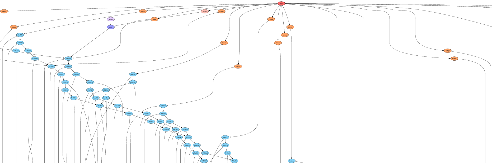

# **Examen Sustitutorio Chowdhury Gomez Junal**


## 1. Algoritmos sobre grafo git

Cree el  metodo `generar_archivo_dot()` el cual ejecuta el comando `git graph ./demo` el cual genera un archiv .dot en `demo/` para esto se requeire haber instalado lo `requirements.txt`  y haber descargado `graphviz`, este metodo genera el archivo `.dot` luego en el archivo `src\dag.py` se calcula las metricas:

- Primero `leer_archivo_dot()` lee el archiv `demo.dot` y lo convierte a un objeto `graphviz` grafo
### **Densidad de ramas**
- el metodo `calcular_densidad(grafo, nodo)` calcula la densidad de un nodo crando un arreglo de dependencias y devolviendo su longitud

### **crithical path**
- el metodo `dikstra_inverso()` para este caso lo que hace es calcular el camino desde el head hasta un nodod especifico puede ser un commit con un  tag

### **Top-k**
- el metodo `k_commits_mayor_indegree()` halla los k commits con mayor indegree para esto se halla todos los caminos y se ordena por indegree y retorrna los k mayores

## 3. CI/CD pipeline
el pipeline lo diseñe sin embargo no va funcionar ya que no llegue a implementar los test
el pipeline consiste en:

1. Validacion de linter, para este caso se usa flake8 previamente instalado en los `requirements.txt`
```yaml
    # instalar dependencias
    - name: Install dependencies
      run: |
        python -m pip install --upgrade pip
        pip install -r requirements.txt
    # ejecutar flake8
    - name: Run flake8
      run: |
        flake8 
```
2. Simula una validacion de `shellcheck`
```yaml
    #shellcheck
    - name: Run shellcheck
      run: |
        apt-get install shellcheck
        shellcheck scripts/ci.sh
```
3. Ejecuta los test (sin embargo al no haberlo implementado falla el pipeline) 
```yaml
    # ejecutar  pruebas de cobertura
    - name: Run tests with coverage
      run: |
       pytest tests/ --cov=models --cov-report=html
```
4. crearia un artefacto de github con el reporte `htmlcov/` con en informe de cobertura esto en mis actividades si los llego a implementar por ejemplo [ACTIVIDAD 12](https://junalchowdhuryg.github.io/Actividades-CC3S2/Actividad-12/docs/)

```yaml
    # subir informe cobertura como artefacto
    - name: Upload coverage report
      uses: actions/upload-artifact@v4
      with:
        name: coverage-report
        path: .
```
5. tambien se generaria el changelog.md como artefacto con los ultimos 5 commits

```yaml
    #generar changelog.md con los ultimos 5 commits
    - name: Generate changelog
      run: |
        git log -n 5 --pretty=format:"* %s" > changelog.md
```

## 4. testing profundo
No llegue a implementar el testing

## adicional makefile
llegue a implementar un Makefile que lo que hacia era:


* instalar dependencias
```Makefile
# instalar dependencias
deps:
	$(PIP) install -r requirements.txt
```

* ejecutar pruebas
```Makefile
# ejecutar pruebas
test:
	$(PYTHON) -m pytest $(TEST_DIR) -v
```

* ejecutar linting con flake8

```Makefile
# ejecutar linting con flake8
lint:
	$(PYTHON) -m flake8 models tests > $(FLAKE_REPORT) || true
```

* construccion de imagenes

```Makefile
#construir imagen
build:
	docker-compose up -d --build
```
* y la ejecucion de todo
```Makefile
# ejecutar todas las tareas
all: deps  lint test build deploy
```


## 5. preguntas tecnicas
Las preguntas estan  en el archivo [respuestas.md](./respuestas.md)
1. **Por que Git es un DAG y justifica por que no hay ciclos y como esto garantiza la terminacion de algoritmos de busqueda de rutas**


  
Por ejemplo en este grafico es parte del historial de un repositorio de git de mi [Practica Calificada 4](https://github.com/JunalChowdhuryG/Grupo-2-Practica-Calificada-4) cada commit es un nodo y las ramas son los commits que se crean a partir de un commit anterior no hay ciclos porque si no se perderia el historial de los commits ya que esto implica que un commit  puede apuntar a uno de sus ancestros y esto crearia un bucle en el grafo  esto garantiza que no haya ciclos en el grafo lo que significa que no se puede volver a un commmit anterior a menos que se cree un nuevo commit que apunte al ese commit anterior y esto ayuda en la terminacion de algoritmos de busqueda de rutas ya que se puede garantizar que no se volvera a visitar un nodo y no entraria en un bucle infinito ya que estaria visitando el mismo nodo una y otra vez

El documento generado esta en [docs/demo.pdf](docs/demo.pdf)


2. **Mediator vs Adapter**

[Medium: Backpressure Explained](https://medium.com/@jayphelps/backpressure-explained-the-flow-of-data-through-software-2350b3e77ce7)
teniendo en cuenta que back-pressure es  mecanismo que permite a un sistema manetener el control el flujo de datos entre componentes para evitar la sobrecarga y garantiza que los recursos se utilicen de manera eficiente

ya que mediator permite la comunicacion de componenetes sin que estos se conoscan directamente esto reduce el acoplamiento entre ellos y esto en un entorno de microservicion es uti l ya que los servcios se pueden desrrollar de manera independiente y al utilizar el mediator se pueede centralizar la logica de comunicacion y tambien la tranformacion de mensajes esto ayuda en la implementacion de back presure en cambio el adapter si bien es cierto facilicta la tranformacion de mensajes en diferentes fomatos este no considera el problema de acoplamiento de la mismaforma que mediatorr ya que adapter puede introducir dependencias directas entre lso componentes esto  puede dificultar la implementacion osea puede generar una difificultad al implementar la logica back pressure al crear acoplamiento osea uno depende de otro
